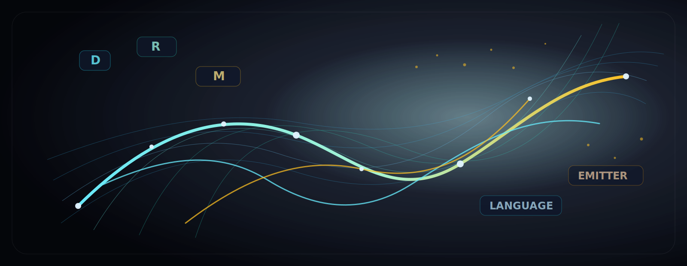

# DRM Language Emitter

**A geometry-first language model lab for building generative AI without attention, without Q/K/V, and without Transformer blocks.**



[](pyproject.toml)
[](pyproject.toml)
[](ARCHITECTURE.md)
[](tests/test_no_transformer.py)
[](docs/benchmarks/README.md)
[](LICENSE)

DRM Language Emitter turns language generation into controlled motion through a learned relational manifold: active directions choose where the model can move, a learned metric shapes how expensive that movement is, and an emitter decodes the resulting state into tokens.

This is a research scaffold, not a production model and not a claim of superiority over Transformers or general world models.

## Quick Links

- [Architecture](ARCHITECTURE.md)
- [Formal DRM Implementation Roadmap](roadmap.md)
- [Mathematical Notes](docs/math.md)
- [Competition Protocol](docs/competition.md)
- [Tiny World-Model Competition](docs/world_model_competition.md)
- [Scale LM Comparison](docs/scale_lm_comparison.md)
- [Technical FAQ and Benchmark Methodology](docs/TECHNICAL_QA.md)
- [Benchmark Artifacts](docs/benchmarks/README.md)
- [Model Card](MODEL_CARD.md)
- [Limitations](docs/limitations.md)
- [API Reference](docs/api.md)
- [Minimal Training Loop](docs/examples/minimal_training_loop.md)
- [Minimal Training Notebook](docs/notebooks/minimal_training_loop.ipynb)
- [Compliance Checklist](docs/compliance_checklist.md)
- [Third-Party Licenses And Data Provenance](docs/third_party_licenses.md)
- [Commercial License](LICENCE-COMMERCIAL.md)

## What Makes It Different

DRM Language Emitter does not use:

- Transformer blocks;
- self-attention;
- Q/K/V attention;
- `nn.MultiheadAttention`;
- KV cache.

Its central computation is a latent trajectory:

```text
token e_t
  -> latent state z_t in M
  -> active directions D(z_t)
  -> gates a_i(z_t), effective dimD(z_t)
  -> relational metric g_z = diag + U U^T
  -> velocity dz in span(D(z_t))
  -> z_{t+1}
  -> token logits
```

The working hypothesis is that language generation can be modeled as motion through a relational state space, where geometry is measurable through action, condition, active dimension, recurrence, stability, and low-action path diagnostics.

## Install

```bash
pip install -e .
```

Optional dev tools:

```bash
pip install -e ".[dev]"
```

The project is CPU-runnable. CUDA is optional; the latest local benchmark was CPU-only because the environment reported `torch=2.12.0+cpu` and `cuda_available=False`.

## Quickstart

Train a tiny DRM model:

```bash
python scripts/train_tiny.py --config configs/tiny.yaml --text data/tiny.txt
```

Generate text:

```bash
python scripts/generate.py --checkpoint runs/tiny/drm_tiny.pt --prompt "DRM "
```

Run geometry diagnostics:

```bash
python scripts/eval_geometry.py --checkpoint runs/tiny/drm_tiny.pt
python scripts/eval_geodesic_paths.py --checkpoint runs/tiny/drm_tiny.pt
```

If `data/tiny.txt` is missing, the training script creates a tiny fallback corpus. The default tokenizer is byte-level, so mixed case, digits, punctuation, and prompts such as `DRM` are representable.

## Architecture

```text
input_ids
  |
TokenEmbedding
  |
for each time step:
  z_t
   |
DirectionField(z_t) -> directions V(z_t), gates a(z_t), dimD
   |
RelationalMetric(z_t) -> diag + U U^T
   |
DRMFlow(z_t, e_t, V, a) -> dz in active directional span
   |
metric action g_z(dz, dz)
   |
StateUpdater -> z_{t+1}
   |
LanguageEmitter(z_{t+1}) -> logits
```

The model is autoregressive, but its memory is the evolving latent state rather than attention over a token sequence.

Read the full design in [ARCHITECTURE.md](ARCHITECTURE.md). The planned formal DRM implementation layers, including relational transport, holonomy diagnostics, effective rank, Fisher-Rao pullback, toroidal state dynamics, and explicit anchor maps, are tracked in [roadmap.md](roadmap.md).

## Main Components

- `src/drm_language_emitter/config.py`: `DRMConfig`
- `src/drm_language_emitter/direction_field.py`: active directional fields and gates
- `src/drm_language_emitter/metric.py`: relational metric `diag + U U^T`
- `src/drm_language_emitter/dynamics.py`: DRM flow and metric naturalization
- `src/drm_language_emitter/model.py`: causal language emitter
- `transformer/`: tiny Transformer baseline
- `world_model/`: tiny symbolic seq2seq world-model baseline

## Diagnostics

The code logs and exports:

- cross entropy and approximate perplexity;
- metric action;
- effective active dimension `dimD`;
- gate entropy and hard/soft active fractions;
- metric low-rank norm and condition proxy;
- recurrence and stability proxies;
- learned low-action path diagnostics;
- symbolic world-modeling metrics in the gridworld benchmark.

Important caveat: `scripts/eval_geodesic_paths.py` evaluates learned low-action trajectories. It is not an exact geodesic solver.

## Benchmarks

Benchmark outputs that are small enough to keep are copied to `docs/benchmarks/`. Large run directories remain under `runs/` and are ignored by git.

### DRM vs Transformer

Versioned dashboard:

```text
docs/benchmarks/drm_transformer_full_1k_3k/dashboard.html
```

Run the sweep:

```bash
python scripts/sweep_drm_transformer.py --steps 1000 2000 3000 --seeds 1 2 3 --output-root runs/sweep_drm_transformer
python scripts/make_competition_dashboard.py --root runs/sweep_drm_transformer --title "DRM vs Transformer Sweep"
```

Current interpretation: DRM showed strong step-matched and parameter-matched results in the tiny regime, while Transformer throughput remains much higher. This does not establish broad superiority.

### DRM vs Transformer vs Tiny World Model

Versioned dashboard:

```text
docs/benchmarks/world_model_competition/dashboard.html
```

Run the benchmark:

```bash
python scripts/make_tiny_world_dataset.py --output-root data/tiny_world --seed 1 --grid-size 5 --num-train 20000 --num-val 2000 --max-rollout-len 8
python scripts/sweep_world_model_competition.py --steps 1000 2000 3000 --seeds 1 2 3 --dataset-root data/tiny_world --output-root runs/world_model_competition
python scripts/make_world_model_dashboard.py --root runs/world_model_competition --title "DRM vs Transformer vs Tiny Symbolic World Model"
```

Latest local result:

- 72 runs, 24 aggregate rows.
- Best next-state exact match: `drm_tiny @ 2000` with `0.0751`.
- Lowest invalid-state rate among top next-state rows: `transformer_tiny_220k @ 3000` with `0.0026`.
- Best supervised world-model CE among top rows: `world_model_tiny @ 3000` around `0.2497`, but exact-match metrics remained low.

Interpretation: DRM had the best next-state exact-match score in this tiny symbolic text-world benchmark, but absolute symbolic accuracy is still low. This is a diagnostic result, not evidence that DRM is broadly better than Transformers or general world models.

See [docs/report/002_world_model_competition_2026-06-18.md](docs/report/002_world_model_competition_2026-06-18.md).

## Useful Commands

Quick DRM vs Transformer comparison:

```bash
python scripts/compare_drm_transformer.py --steps 50 --batch-size 4 --output-root runs/quick_compare
```

Robustness:

```bash
python scripts/eval_robustness.py --drm-checkpoint runs/quick_compare/drm/drm_tiny.pt --drm-tokenizer runs/quick_compare/drm/tokenizer.json --transformer-checkpoint runs/quick_compare/transformer/tiny_transformer.pt
```

Bridge diagnostic:

```bash
python scripts/eval_bridge_task.py --checkpoint runs/quick_compare/drm/drm_tiny.pt --tokenizer runs/quick_compare/drm/tokenizer.json
```

Sequence stability:

```bash
python scripts/eval_sequence_stability.py --drm-checkpoint runs/quick_compare/drm/drm_tiny.pt --drm-tokenizer runs/quick_compare/drm/tokenizer.json --transformer-checkpoint runs/quick_compare/transformer/tiny_transformer.pt
```

DRM profile:

```bash
python scripts/profile_drm.py --checkpoint runs/quick_compare/drm/drm_tiny.pt
```

## Tests

```bash
python -m pytest -q
```

If `pytest` is not installed:

```bash
pip install -e ".[dev]"
```

CUDA tests are conditional. They run only when `torch.cuda.is_available()` is true.

## Repository Map

```text
configs/                 DRM and benchmark configs
docs/                    math, limitations, competition notes, benchmark artifacts
scripts/                 training, generation, evaluation, sweeps, dashboards
src/drm_language_emitter/ DRM model package
tests/                   smoke and invariant tests
transformer/             tiny Transformer baseline
world_model/             tiny symbolic world-model baseline
```

## Scientific Status

Allowed claims:

- DRM Language Emitter is a functional non-Transformer language model prototype.
- Its geometry is explicit, measurable, and trainable in small experiments.
- The repository includes controlled tiny comparisons against Transformer and a tiny symbolic world model.

Not allowed:

- DRM is better than Transformers in general.
- DRM is better than world models in general.
- The model has proven emergent geodesics.
- The model has proven toroidal topology.
- The model is production-ready or safety-evaluated.

## Limitations

- The temporal loop is slow compared with optimized Transformer kernels.
- Benchmarks are tiny and diagnostic.
- Low-action path evaluation is not a formal geodesic solver.
- Symbolic world-modeling exact match is still low.
- No large-scale benchmark, RLHF, alignment evaluation, or safety validation is included.
- Toroidal convergence is not guaranteed; it is only a possible diagnostic under boundedness, recurrence, and stability assumptions.

## Roadmap

- Add stronger trajectory integrators and variational path objectives.
- Improve constrained symbolic decoding for the world benchmark.
- Add time-matched CUDA comparisons.
- Broaden ablations around metric, gates, and active dimension.
- Study pullback/Fisher-style metrics as future work.

## License

This project is released under AGPL-3.0. For commercial licensing, see [LICENCE-COMMERCIAL.md](LICENCE-COMMERCIAL.md) or contact `felupe@truthagi.ai`.
